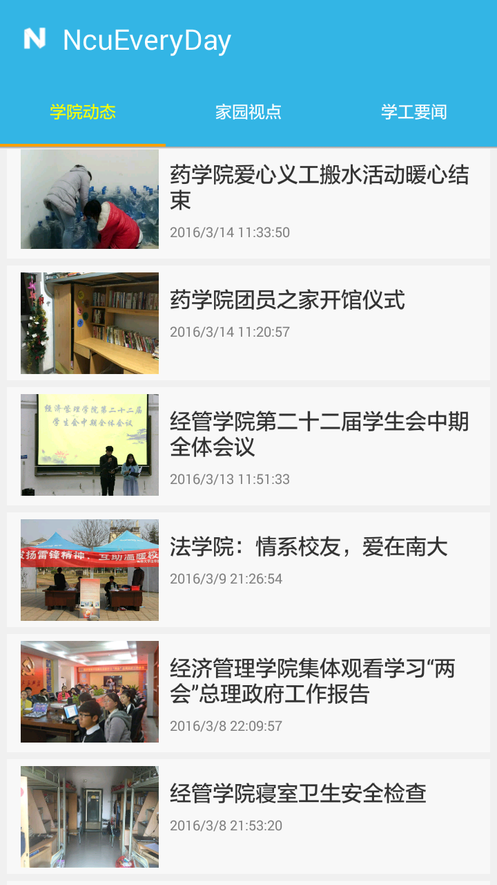
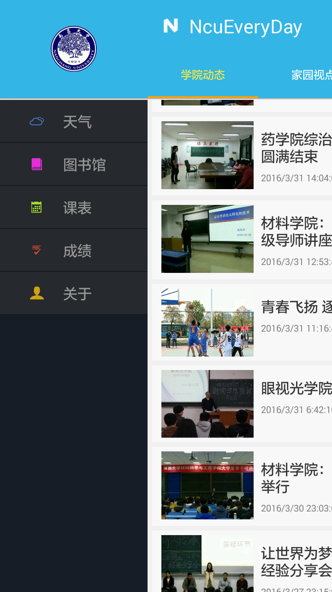

# NcuEveryDay for Android
---
南昌大学第三方 Android 客户端

  

新闻资源来自 @[南昌大学家园网](http://www.ncuhome.cn)

## UI
1. Viewpager+Fragments
2. slidingMenu
3. PullToRefresh

## http
1. async-http
2. glide

## storage
1. SQLite
2. SharedPreferences

## third-party service
1. Bmob
2. Juhe(Weather)
